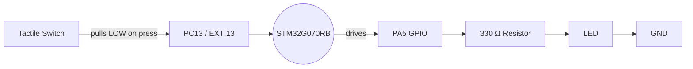
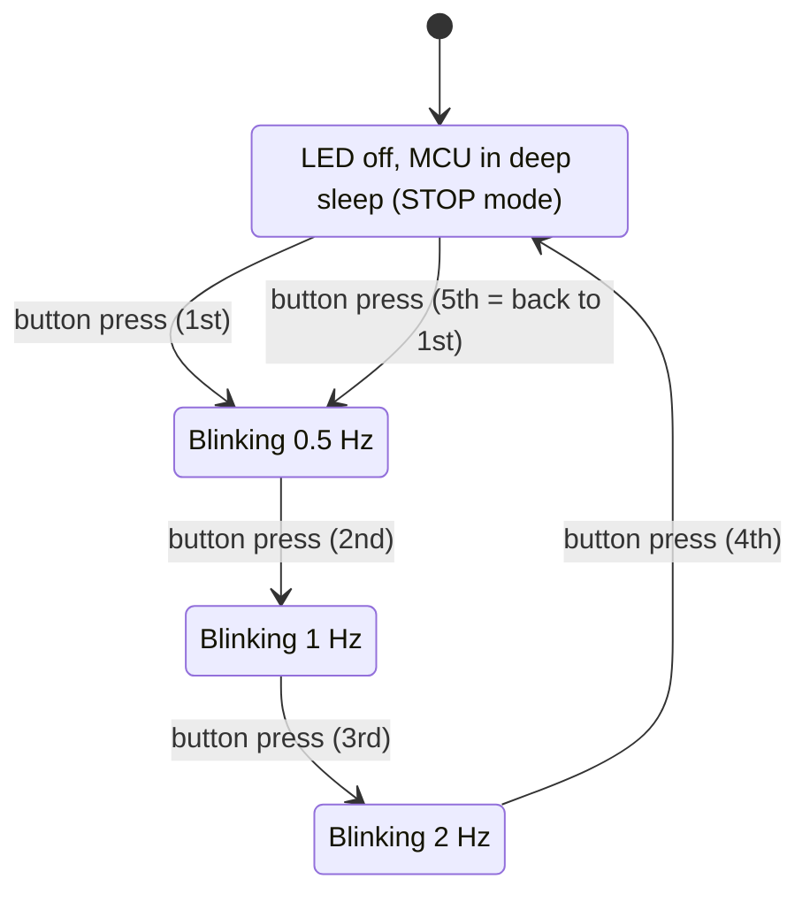
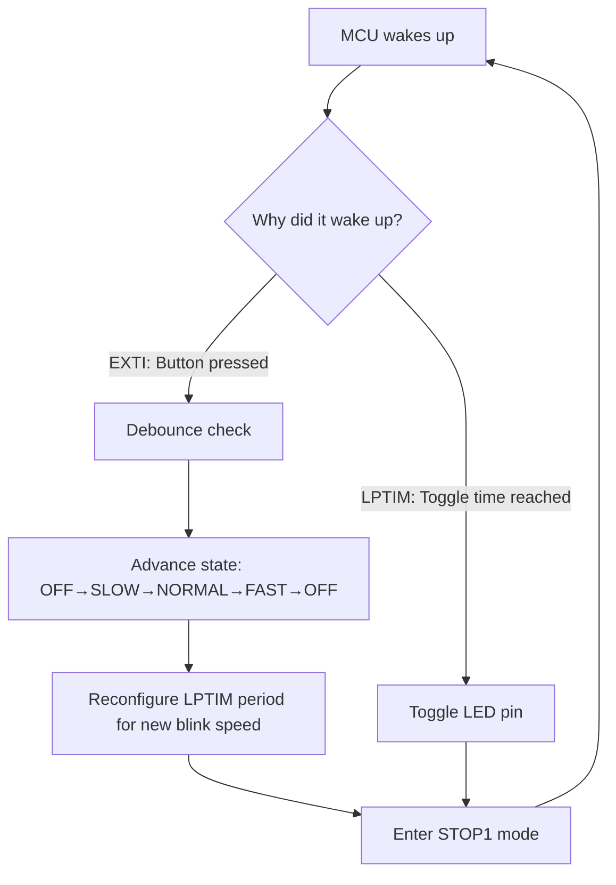

# Switch-Controlled LED Blinker — NUCLEO-G070RB
### (Written for someone coming from Arduino / ESP32 / Raspberry Pi world)

This README is the whole project in one place: what the hardware looks like,
how the logic works, why we picked certain STM32 tricks for low power, and
the full code explained line-by-line in plain English.

---

## 1. The Problem, restated simply

One button. One LED. Every time you press the button, the LED's blink speed
changes, cycling through 4 states:

| Press number | What happens | Blink frequency | Toggle every... |
|---|---|---|---|
| 1st press | LED starts blinking slow | 0.5 Hz (1 blink every 2 sec) | 1000 ms |
| 2nd press | LED blinks normal | 1 Hz (1 blink every 1 sec) | 500 ms |
| 3rd press | LED blinks fast | 2 Hz (2 blinks every 1 sec) | 250 ms |
| 4th press | LED turns OFF | — | — |
| 5th press | back to row 1 | 0.5 Hz | 1000 ms |

> Why "toggle every X ms" matters: an LED that blinks at 1 Hz means it
> completes **one full ON+OFF cycle per second** — so it must flip state
> (toggle) **twice** a second → every 500 ms. This "toggle = half the period"
> math shows up directly in the timer code later.

The twist: this has to be **power-optimized using the STM32's low-power
modes**, not just "blink with delay()" like you'd do on Arduino.

---

## 2. Hardware / Circuit

Good news: the NUCLEO-G070RB already has **both parts onboard**, so for the
interview demo you don't need to solder anything:

| Component | Nucleo pin | Notes |
|---|---|---|
| User push-button **B1** | **PC13** | Already wired to GND with debounce-friendly pull-up. Pressing pulls PC13 LOW. |
| User LED **LD2** | **PA5** | Green LED, already wired through a resistor to PA5. |

If you (or the interviewer) want an **external** switch + LED instead of the
onboard ones (closer to "design a circuit" as asked), here's the simple
schematic:

```
        3V3
         |
         |        +---[ Tactile Switch ]---+
         |         |                       |
        (not       PC13 -------------------+----> GND
       needed,                              (internal pull-up enabled
       internal                              in software, so no external
       pull-up                               resistor is required)
       used)


   PA5 ----[ 330 Ω resistor ]----[ LED Anode | Cathode ]---- GND
```

- **Switch**: one leg to a GPIO pin (PC13), other leg to GND. We turn on the
  microcontroller's **internal pull-up resistor** in software (`GPIO_PULLUP`),
  exactly like `pinMode(pin, INPUT_PULLUP)` on Arduino. No external resistor
  needed.
- **LED**: GPIO pin (PA5) → 330 Ω series resistor (limits current, protects
  the LED and the pin) → LED → GND. Same idea as wiring an LED to an ESP32
  GPIO.

### Block diagram



---

## 3. The "brain" of the project — State Machine

Think of this exactly like a 4-position rotary switch that the button cycles
through. Every press moves you one step forward, and step 5 wraps back to
step 1.



That's it. Four states, one button, wraps around. In code this is just one
counter variable that goes `0 → 1 → 2 → 3 → 0 → 1...` and a `switch/case` (or
lookup table) that decides what the LED should do in each state.

---

## 4. Why this isn't "just delay() and digitalWrite()"

On Arduino you'd write:

```cpp
digitalWrite(LED, HIGH); delay(500); digitalWrite(LED, LOW); delay(500);
```

`delay()` **burns CPU cycles doing nothing** — the chip is fully awake,
clocked at full speed, just spinning in a loop. That's terrible for battery
life. STM32 (and the task itself) wants us to do better:

1. **Never poll. Always interrupt.** The button is read using an
   **EXTI (External Interrupt)** — the CPU isn't checking the pin in a loop;
   the hardware itself wakes the CPU up the instant the pin changes. This is
   like `attachInterrupt()` on Arduino, but on STM32 it can also **wake the
   chip from sleep**, which a plain Arduino interrupt can't always do.

2. **Don't use a CPU timer for blinking — use the LPTIM (Low-Power Timer).**
   STM32G0 has a special timer peripheral that can keep ticking and
   generating interrupts **even while the CPU is in STOP mode** (a deep sleep
   state), as long as it's clocked from the **LSE** (a slow 32.768 kHz
   crystal, the same type used in wristwatches — draws almost no current).
   This means: the CPU can go to sleep, the LPTIM silently counts in the
   background, and only wakes the CPU up for the few microseconds it takes to
   flip the LED pin — then goes straight back to sleep.

3. **Two flavors of "sleep" used here:**
   - **STOP1 mode** — used whenever the LED is OFF (state 4) and we're just
     waiting for the next button press. Deepest sleep we can use while still
     waking up instantly on a button press (EXTI). Power draw here is in the
     **microamps**.
   - Also **STOP1 mode** *during blinking* — between LED toggles, the CPU
     has literally nothing to do for hundreds of milliseconds, so it goes
     back to STOP1 every single time, and the LPTIM interrupt wakes it only
     to toggle the pin.

   So actually the CPU is **asleep almost 100% of the time**, in every state.
   It only "blinks awake" for microseconds either to toggle the LED or to
   register a button press.

### Power flow diagram



---

## 5. Code — fully commented, humanized

The code below uses **STM32CubeIDE / STM32 HAL** (the "Arduino library"
equivalent for STM32 — Hardware Abstraction Layer). I've renamed every
variable to something self-explanatory instead of the typical terse STM32
naming, and added a comment on basically every line.

See `switch_led_blink.c` in this same folder. The structure is:

```
main()
 ├─ System_Clock_Setup()        // configures MCU + enables LSE crystal
 ├─ LED_Pin_Setup()              // PA5 as output
 ├─ Button_Interrupt_Setup()     // PC13 as EXTI input, pull-up, falling edge
 ├─ LowPowerTimer_Setup()        // LPTIM1 clocked from LSE
 ├─ Enter_Sleep_Forever()        // infinite loop that just goes back to STOP1
 │
 ├─ EXTI15_10_IRQHandler()  → Button_Pressed_Callback()
 │     - software debounce
 │     - advance blinkState (0,1,2,3,0,1,...)
 │     - reprogram LPTIM period for new frequency (or stop it if OFF)
 │
 └─ LPTIM1_IRQHandler()     → Blink_Timer_Tick_Callback()
       - toggles the LED pin
```

### Key "translate from Arduino" cheat sheet

| Arduino concept | STM32 HAL equivalent used here |
|---|---|
| `pinMode(LED, OUTPUT)` | `HAL_GPIO_Init()` with `MODE_OUTPUT_PP` |
| `pinMode(BTN, INPUT_PULLUP)` | `HAL_GPIO_Init()` with `MODE_IT_FALLING` + `PULLUP` |
| `attachInterrupt()` | NVIC + `HAL_GPIO_EXTI_Callback()` |
| `digitalWrite(LED, !state)` | `HAL_GPIO_TogglePin()` |
| `delay(ms)` | **Not used at all** — replaced by LPTIM interrupts |
| `millis()` debounce | a saved timestamp compared on each press |
| Arduino "sleep" libraries | `HAL_PWR_EnterSTOPMode()` (built into HAL, no extra library) |

---

## 6. Recommended STM32 simulators (since you've never touched STM32 hardware)

You don't need physical hardware to test the *logic* before the interview.
Options, roughly best-to-worst for this specific project:

1. **STM32CubeIDE built-in debugger + "Native simulation" / SWV** — Not a
   full simulator, but lets you single-step the code and watch variables;
   good enough to prove the state machine logic works. Free, official.
2. **Renode** (renode.io) — Open-source, simulates real STM32 peripherals
   (GPIO, EXTI, timers) and can run your compiled `.elf` almost exactly like
   real silicon, including interrupts. This is the closest thing to "a real
   Nucleo board in software." Good for proving the whole interrupt-driven
   design works before you ever touch a board.
3. **QEMU with STM32 support** (e.g. `qemu-system-arm` + STM32 boards via
   community forks like `xpack-qemu-arm`) — More setup effort, less
   peripheral fidelity than Renode for this chip, but works for basic GPIO.
4. **Proteus (Labcenter)** — Paid, but has STM32 models, lets you literally
   draw the switch + LED + resistor circuit and simulate it visually. Great
   if you want to *show a working schematic* in your assignment, not just code.
5. **Wokwi** — Excellent for Arduino/ESP32 (which you already know), but as
   of now it does **not** support STM32G0 boards specifically. Skip it for
   this exact chip; mentioned only so you don't waste time looking for it.

For the actual in-person interview, since they said "showcase on a NUCLEO
board," treat the simulator as your *rehearsal* tool only — budget time to
flash and test on the real NUCLEO-G070RB at least once before that meeting,
since timer-clock-source quirks (LSE not fitted/enabled on some Nucleo
revisions) only show up on real hardware.

> ⚠️ Hardware note: Some NUCLEO-G070RB boards ship with the LSE crystal
> **not populated** by default (check solder bridges SB45/SB46 and the
> X2/X3 crystal footprint in the board's User Manual UM2324). If your LSE
> doesn't start, the code below falls back to clocking the LPTIM from LSI
> (~32 kHz internal RC) — slightly less accurate frequency, but it still
> works in STOP mode and still proves the same power-saving concept. This
> fallback is included in the code, with a comment explaining the trade-off.

---

## 7. Suggested "prompt to visualize this project"

If you want to feed something into an AI image/diagram tool to get a clean
visual for your slide/report, use this:

> "Create a clean technical block diagram of an STM32 Nucleo development
> board with a single tactile push-button connected to GPIO pin PC13 with
> EXTI interrupt, and a single LED connected via a 330-ohm resistor to GPIO
> pin PA5. Show an arrow from the button through a 'debounce + state
> machine' box into a 'Low Power Timer (LPTIM)' box, then to the LED. Add a
> small inset showing the MCU going into 'STOP1 low-power sleep mode'
> between events. Minimalist engineering schematic style, labeled pins,
> white background."

---

## 8. Quick demo script for the in-person interview

1. Power the board — LED off, nothing blinking (state OFF, MCU asleep).
2. Press B1 once → LED blinks slowly (0.5 Hz) — let it run a few seconds to
   visibly show the slow rate.
3. Press again → faster (1 Hz).
4. Press again → fastest (2 Hz).
5. Press again → LED off again, loop proven.
6. Optional power flex: if they have a multimeter/power profiler, clip it
   onto the board's current-measurement header and show the µA-level draw
   while idle (STOP1 mode) vs the mA-level draw when the debugger forces it
   awake — this is the strongest way to prove the "optimized for power"
   requirement wasn't just a comment in the code.

---

## 9. Files in this project

- `README.md` — this file
- `switch_led_blink.c` — the full, heavily commented source file
